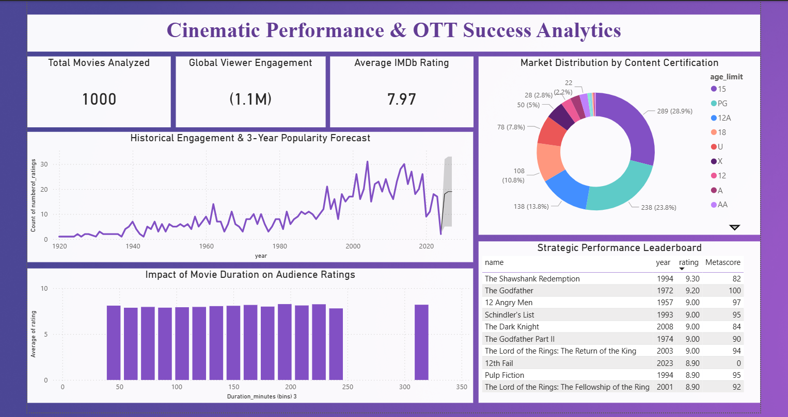

# Cinematic Performance & OTT Success Analytics

## 📊 Project Overview
This project is a Data Analytics Capstone developed for the **Microsoft Elevate Virtual Internship**. It leverages Power BI to transform a dataset of 1,000 top-rated movies into strategic insights, helping stakeholders identify the "Success Formula" for content production and acquisition in the competitive OTT landscape.

## 🛠️ Tech Stack
* **Analytics Tool:** Microsoft Power BI Desktop
* **Data Transformation:** Power Query (Custom M-Code)
* **Modeling:** DAX (Data Analysis Expressions)
* **Algorithm:** Exponential Smoothing (ETS) for Time-Series Forecasting

## 🚀 Key Technical Implementation
* **Advanced ETL Pipeline:** Developed custom transformation logic to convert complex duration strings (e.g., "2h 22m") into numerical minutes for accurate statistical correlation.
* **Predictive Modeling:** Implemented a **3-Year Popularity Forecast** using the **ETS algorithm** with a 95% confidence interval to predict audience engagement trends.
* **Data Schema:** Designed a clean data model to support high-performance filtering across years, ratings, and age certifications.

## 📈 Dashboard Insights
* **Trend Analysis:** The historical engagement chart identifies key spikes in movie ratings over the decades, with a projected growth trend for the 2026-2028 window.
* **Duration Sweet Spot:** Analysis reveals a "sweet spot" for movies between **120-150 minutes**, which consistently secure the highest average IMDb ratings.
* **Market Distribution:** Content certified as '15' and 'PG' dominates the high-performance charts, suggesting these categories have the highest market reach.

## 📂 Repository Contents
* `Movie_Analytics_Dashboard.pbix`: The final interactive Power BI Dashboard.
* `imdb_top_1000.csv`: The cleaned dataset used for this analysis.
* `Capstone_Project.pdf`: The technical presentation following the Microsoft Elevate template.

---
**Author:** Kritika Kumari  
*B.Tech in Computer Science Engineering | 2024-2028*
